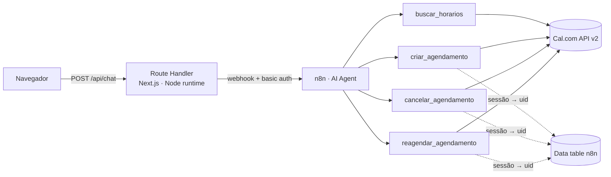

# Lucas Abreu - Automation & AI Portfolio

Portfólio profissional e Landing Page de alto desempenho desenvolvida em **Next.js 16 (App Router)** com **TypeScript** e **Tailwind CSS v4**. O projeto destaca o perfil técnico de **Lucas Abreu**, seus principais projetos e as soluções automatizadas entregues para empresas.

O portfólio não só descreve os agentes — ele roda um. Em [`/demo/agendamento`](src/app/demo/agendamento/page.tsx) qualquer visitante marca, remarca e cancela um horário conversando em linguagem natural, contra uma agenda real. Detalhes em [Demo ao vivo](#-demo-ao-vivo-agente-de-agendamento).

---

## 👤 Quem é Lucas Abreu

Lucas Abreu é um Desenvolvedor especializado em **Automação Inteligente** e **Engenharia de Agentes de Inteligência Artificial**. Com foco em transformar problemas complexos de negócios em fluxos de dados funcionais e inteligentes, ele projeta arquiteturas integrando assistentes virtuais de visão computacional, memórias vetoriais (RAG) e barramentos automatizados de dados.

---

## 📦 O que pode ser entregue (Soluções de Valor)

### 1. Automação Inteligente (Intelligent Automation)
- Desenho, modelagem e deploy de pipelines de integração de dados corporativos utilizando **N8N** e **Python**.
- Conexão e sincronização em tempo real de CRMs, bancos de dados relacionais/NoSQL, sistemas de chat (Telegram, WhatsApp) e APIs REST.
- Automação de tarefas administrativas, relatórios de mercado automatizados e fluxos de e-mail transacionais.

### 2. Engenharia de Agentes (Agent Engineering)
- Criação de assistentes virtuais autônomos integrados a LLMs líderes de mercado (Gemini, Claude, OpenAI).
- Implementação de **RAG (Retrieval-Augmented Generation)** utilizando bancos de dados vetoriais (Vector Stores) para fornecer respostas contextualizadas com documentos corporativos.
- Processamento multimodal em tempo real (áudio, voz, texto e visão computacional).

### 3. Engenharia de Prompts Especializada (Specialized Prompting)
- Arquitetura de cadeias de prompts estruturadas (Chain-of-Thought, System Instructions robustas) para garantir tomadas de decisão lógicas e sem alucinações.
- Estruturação de respostas de IAs em formatos específicos (JSON, Markdown, tabelas) integráveis com sistemas legados de software.

---

## 🚀 Projetos em Destaque

O portfólio apresenta de forma interativa os seguintes projetos desenvolvidos:

### Automação & Agentes de IA
- **Scheduling Agent (Agente de Agendamento) — demo ao vivo:** Agente conversacional que consulta disponibilidade, cria, remarca e cancela reservas pela API do **Cal.com**. Roda dentro do próprio portfólio, sem cadastro e sem instalar nada. Arquitetura detalhada [abaixo](#-demo-ao-vivo-agente-de-agendamento).
- **AI Assistant:** Assistente inteligente autônomo no Telegram. Lê e processa texto, imagem e áudio em tempo real integrado a um banco de memória vetorial (RAG) via N8N e Gemini.
- **Jobs Dashboard (Dashboard Vagas):** Painel de inteligência de mercado em tempo real. Pipeline de dados automatizado com N8N que lê APIs de vagas públicas e armazena os dados filtrados em PostgreSQL (Supabase).

### Websites & Interfaces Otimizadas
- **Artools:** Landing page altamente animada e voltada a conversão para a caneta de precisão da Artools.
- **Zingen:** Interface interativa e responsiva de um aplicativo móvel de karaokê familiar.
- **Travelgram:** Rede social voltada a registros fotográficos e relatos de viagens pelo mundo.
- **Tech News:** Homepage responsiva e moderna de um portal de notícias de tecnologia.
- **AluraBooks:** E-commerce voltado a venda de livros com layout responsivo e dinâmico.

---

## 🤖 Demo ao vivo: Agente de Agendamento

Rota: **`/demo/agendamento`**

Um agente conversacional ligado a uma agenda real do **Cal.com**. O visitante escreve em português ou inglês — *"quais horários vocês têm quinta?"* — e o agente consulta a disponibilidade, marca, remarca e cancela. Sem login, sem formulário, sem instalar nada.

### Como está montado



O agente usa **Gemini** como modelo principal, com fallback para **Groq** quando o primário falha. `buscar_horarios` é uma chamada HTTP direta; as outras três são sub-workflows do n8n, porque cada uma precisa de lógica depois da resposta da API — e um nó de ferramenta HTTP é folha, não encadeia pós-processamento.

### Decisões de arquitetura

O interessante da demo não é o agente marcar horário — é o que impede ele de fazer besteira num endpoint aberto na internet.

| Decisão | Por quê |
|---|---|
| **O navegador nunca fala com o n8n** | A credencial fica no Route Handler, junto com o limite por IP. É o único ponto onde dá para impor isso. |
| **Posse por sessão** | O id da conversa é gerado no servidor, em cookie `httpOnly`. Não é preferência do cliente, é token de posse: só quem tem o cookie alcança a reserva criada naquela conversa. |
| **Identidade nunca vem do modelo** | Nenhuma ferramenta aceita e-mail ou id escolhido pelo LLM para localizar uma reserva — isso seria negociável em linguagem natural. Cancelar e remarcar só operam sobre o que aquela conversa criou. |
| **Confirmação imposta pelo servidor** | Marcar e cancelar exigem duas chamadas, em turnos diferentes: a primeira só registra a intenção e devolve os dados para conferência. Pedir confirmação no prompt não bastava — o modelo às vezes pulava a etapa. |
| **Falha não vira sucesso** | Quando a agenda recusa, a ferramenta devolve um status, não um stack trace. Antes disso o agente lia o erro e anunciava sucesso assim mesmo. |
| **Remarcar grava o uid novo** | Na API v2 do Cal.com, remarcar cancela a reserva antiga e cria outra. Sem gravar o identificador devolvido, o cancelamento seguinte apontaria para uma reserva já cancelada. |

O escopo por sessão é a versão leve do padrão correto. Num sistema real, a posse viria de um magic link no e-mail de confirmação ou de um código de uso único.

### Limites deliberados

- **Rate limit por IP:** 8 mensagens/minuto e 40/hora, ajustáveis por variável de ambiente.
- **Mensagem:** máximo 2000 caracteres; corpo da requisição, 16 KB.
- **Sessão:** expira em 2 horas.
- **Resposta do agente:** teto de 120 s.

---

## ⚙️ Rodando localmente

```bash
npm install
cp .env.example .env.local   # preencha os valores
npm run dev
```

A home funciona sem nenhuma configuração. **Só a rota `/demo/agendamento` precisa das variáveis** — sem elas o Route Handler responde `503` e o restante do site segue normal.

| Variável | Para quê |
|---|---|
| `N8N_CHAT_WEBHOOK_URL` | Webhook do Chat Trigger do workflow de agendamento |
| `N8N_CHAT_BASIC_AUTH_USER` / `_PASSWORD` | Basic auth desse webhook |
| `DEMO_CHAT_BURST_LIMIT` / `_HOURLY_LIMIT` / `DEMO_CHAT_TIMEOUT_MS` | Opcionais; os defaults estão no código |

O [`.env.example`](.env.example) documenta o formato de cada uma e algumas armadilhas — em especial, use **só caracteres `base64url` na senha**: o Next expande variáveis ao carregar o `.env`, então um `$` no meio do valor é engolido em silêncio e o resultado é um `502` sem pista.

> `.env.local` não vai para o git. Este repositório é público.

---

## 🛠️ Stack Tecnológica

O projeto foi modernizado para as seguintes tecnologias para garantir máxima performance de renderização e SEO:

- **Framework:** [Next.js 16 (App Router)](https://nextjs.org/)
- **Biblioteca:** [React 19](https://react.dev/)
- **Linguagem:** [TypeScript](https://www.typescriptlang.org/)
- **Estilização:** [Tailwind CSS v4](https://tailwindcss.com/) (com PostCSS e CSS Variables sem arquivos JS de configuração herdados)
- **i18n Context:** Sistema customizado de internacionalização (PT-BR / EN) com persistência nativa em `localStorage`.
- **Animações:** Hooks customizados acionando `IntersectionObserver` de scroll (`useInViewAnimation`) e foco móvel (`useMobileFocus`).
- **Otimização de Mídia:** Componente `<Image />` do `next/image` configurado com `priority` e `sizes` responsivos.

### Backend da demo de agendamento

- **Orquestração:** [n8n](https://n8n.io/) — um workflow agente e três sub-workflows de ferramenta.
- **Modelos:** [Gemini](https://ai.google.dev/) como primário, [Groq](https://groq.com/) como fallback.
- **Agenda:** [Cal.com API v2](https://cal.com/docs/api-reference/v2/introduction).
- **Borda:** Route Handler do Next.js em runtime Node, com rate limit em memória por IP e sessão em cookie `httpOnly`.
